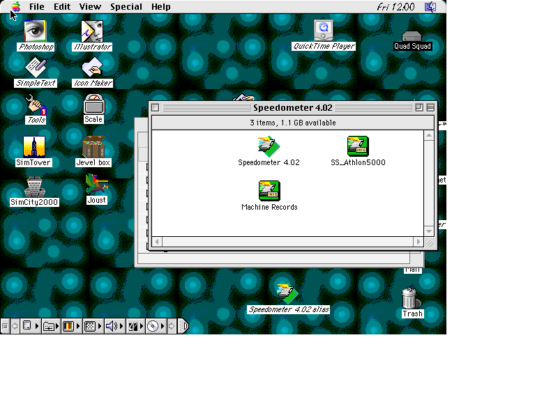

# P260 two-half sector buffer: simulation qualification, 2026-09-29

P260 is commit `583a98c`, "ncr53c96: P260, a two-half sector buffer so
platform transfers overlap the guest". Everything below is simulation and
directed benches. Nothing in `rtl/`, the `.qsf` or the tracked sim sources
was changed, nothing was committed, and no hardware was used. The scratch
area is `scratch/p260_qual_20260929/`.

## Verdict

**P260 as committed (`583a98c`) must not be built.** It cannot boot any disk
in the full-machine sim. The ROM's boot-time reads end in STATUS one sector
early, with 511 bytes unread. The boot hangs at the happy Mac: every one of
the 19 runs stopped at 5.4 guest seconds, the 18 System 7.5.5 runs and the
Mac OS 8.1 run alike.

- **Cause:** one missed `!pf_valid` term in the non-DMA (PIO) data-in
  underflow arm (section 1).
- **Fix:** a one-line change, `pio_underflow_pf_valid.diff` in this
  directory. It applies cleanly (`git apply --check`) to HEAD.

**With that line added, P260 qualifies:**

- **Copies:** all 18 randomised-latency copies complete, and every copy is
  byte-identical to the source.
- **Hangs and faults:** none. There are 0 SDMA faults. Four runs trip the
  harness's stall detector after their copy ended; this is a tap artefact
  that the old-engine controls show too (section 3).
- **Copy time:** every seed is faster, by 2.2 % to 33.6 %.
  - The saving is almost constant at about 1.8-1.9 guest seconds per 3.96 MB
    copy. That is the guest's drain and fill time per sector, now hidden
    under the SD service.
  - Seeds dominated by write-buffer stalls therefore gain the least in
    relative terms.
- **Mac OS 8.1:** boots to the Finder.
- **Directed benches:** the new directed benches pass, as do the tracked
  `tb_ncr53c96` suite and the three iosb benches.

The Speedometer Performance Rating was not run. No sim control stream for it
exists: only FPU, Mix and Color8 streams do, for the 7.5.5 Speedometer disk.
The Performance Rating screenshots in `docs/perf/` are all from hardware.

## 1. The boot hang on `583a98c` and its fix

**Symptom.** In every run, the sim stops raising disk requests at clock
177,950,337, which is 5.4 guest seconds. The screen stays on the happy Mac
(`g1_head583a98c_stuck_happymac_29s.png`). The ROM then loops forever in
MESSAGE IN, issuing `$10`.

**The ROM's read shape.** For each sector, the ROM:

1. takes 2 bytes by non-DMA TI (`$10`);
2. takes 510 bytes by DMA TI (`$90`);
3. flushes the FIFO twice;
4. issues the next sector's first `$10` **before** that sector has arrived.

**The engine trace** (`scratch/p260_qual_20260929/stalled_p260_boot/g1.run.log.gz`):

```
[NCR 177937194] cmd=10 ph=1 ... bl=0 sp=512      PIO TI for the last sector's byte 0 (it is still being fetched)
[NCR 177949825] io_ack+ rd=1                    the last sector streams into the idle half
[NCR 177950337] io_ack- ...                     it lands: pf_valid <= 1
[NCR 177950339] INT+ ist=10 ph=3                STATUS, with the whole last sector unread
```

**The mechanism** (`rtl/ncr53c96.sv:1235`, the non-DMA data-in underflow
arm):

```systemverilog
if (xfer_pio_in && !byte_avail && blocks_left == 0 && !nexus_io &&
    !synth_on) begin               // <- no !pf_valid
    xfer_pio_in <= 0; phase <= PH_STAT; raise(I_BUS);
```

- On the clock the last sector's ack falls, `nexus_io` drops and `pf_valid`
  rises.
- The swap to the new half is only scheduled on that clock, so `byte_avail`
  is still 0 (the active half is spent), and `blocks_left` is 0 because it
  was decremented when the prefetch was raised.
- The underflow arm therefore fires on the same clock as the swap. The PIO
  byte is never handed over, and the phase goes to STATUS.
- The commit message lists "PIO, chunk-complete, underflow and bus_free"
  as carrying `!pf_valid`. The PIO *hand-over* arm (line 971) and both DMA
  underflow arms (lines 1034 and 1040) have it. This PIO *underflow* arm was
  missed.
- The old engine never had a window here: its last-sector fetch kept
  `nexus_io` high until `buf_valid` was set, on the same clock.

**Why `tb_ncr53c96` missed it.** Its PIO reads never issue a PIO TI while
the last sector of a multi-block READ is still in flight.

**The fix** (`pio_underflow_pf_valid.diff`):

```diff
 		if (xfer_pio_in && !byte_avail && blocks_left == 0 && !nexus_io &&
-		    !synth_on) begin
+		    !synth_on && !pf_valid) begin
```

**Checks on the fix:**

- **Directed reproduction, T_P260b** (section 5): FAILs on `583a98c`,
  exactly as in the boot ("STATUS after PIO byte 0 of sector 3 (of 4): the
  command ended with 511 bytes unread"). PASSes on the old engine
  (`703b22a`) and on `583a98c` plus the fix.
- **The tracked `tb_ncr53c96` tests plus T_P260/T_P260b** on the fix:
  528,767 checks, 0 failures.
- **`tb_scsi_irq_ack_race`, `tb_sdma_ack_watchdog` (ACK_LEN=6000) and
  `tb_iosb_scc`** on the fixed tree: PASS.

## 2. Harness

**Trees.**

- `tree/` is a `git archive` of HEAD `583a98c`.
- `tree_fix/` is the same plus the one-line fix. It is the tree qualified
  below.
- `tree_old/` is HEAD~1 `703b22a`: the old engine, with the IOSB interrupt
  and watchdog fixes already in. It is used for controls.

**Harness modifications**, copied over exactly as in
`scratch/scsi_hang_20260928/tree2` (the `docs/scsi-write-hang-20260928.md`
recipe):

- **`verilator/Makefile`:** the V_DEFINE block with every CPU macro of the
  release `.qsf`, `SCSI_CACHE_OFF=1` and `HANGDBG=1`.
- **`verilator/sim/sim_blkdevice.cpp`:** the randomised per-request SD model
  (`+lat_*`, `+stall_*`, `+ack_word`, `+ackstall_*`, `+arm_cycle`).
- **`verilator/sim_main.cpp`:** the liveness and idle-quit detectors.
- **`rtl/iosb.sv`:** HEAD's `iosb.sv`, which already carries the IFR and
  watchdog fixes, with the `HANGDBG` taps block appended.

**Additions for this run:**

- **`[P260STAT]` counters** in the `iosb.sv` HANGDBG block, counted after
  `+hang_arm=1140000000`:
  - prefetches raised (`pf_fill` rising);
  - prefetches raised while the guest was still draining
    (`buf_valid && sbuf_pos < sbuf_len`), and the bytes it had left;
  - swaps, and swaps where the guest had already spent its half when the
    sector landed (`swap_wait`);
  - WRITE chunk completions, and those with a flush in flight.
- **`[P260GAP]` lines** in the SD model: ack-fall to next-request gap
  statistics, split by the type of the next request.

**Runs.**

- **Seeds:** the same 18 plusarg sets as g1-g18 of the hang investigation
  (`plan.txt`).
- **Guest:** the same golden disk (System 7.5.5, "Big File" of 3,958,784
  bytes) and the same `control_dup.txt`.
- **Launch:** one `systemd-run --user --collect` unit per run.
- **Byte check:** after each run, `run_one.sh` does an `hcopy -r` of
  ":Desktop Folder:Big File" and ":Desktop Folder:Big File copy" and `cmp`s
  both against the golden file (sha256 `73e14c06…`).
- **Copy time:** measured as in `runs_summary.txt`: first to last disk
  request after the arm point, at 33 MHz.

**Old-engine controls.** Seeds 1, 14 and 18 were run on `tree_old`
(o1/o14/o18). They reproduce the old `runs_summary.txt` times exactly:

| control | this run | old summary |
|---|---:|---|
| o1 | 7.44 s | 7.44 s |
| o14 | 10.14 s | 10.15 s (g14f on the IRQ fix; stock g14 hung) |
| o18 | 3.79 s | 3.79 s |

So the comparison below is between engines, not between harness versions.

## 3. Per-seed results (System 7.5.5 Finder duplicate of 3.96 MB)

Column key:

- **ident**: `hcopy`+`cmp` of source and copy against the golden file.
- **old s**: from `scsi_hang_20260928/runs_summary.txt` at the same plusargs.
- **stalls pre / in**: the model's injected stalls, before the ack and inside
  the ack window.
- **pf / ovl**: read prefetches, and those raised while the guest was still
  draining.
- **ready**: prefetched sectors already waiting when the guest finished the
  previous one (`pf - swap_wait`).
- **wr cc / w/ flush**: WRITE chunk completions, and those that completed
  with a flush in flight.

| seed | model | outcome | ident | rd / wr | copy s (P260+fix) | old s | Δ | stalls pre / in | pf | ovl | ready | wr cc | w/ flush |
|---|---|---|---|---|---:|---:|---:|---|---:|---:|---:|---:|---:|
| g1 | lat 0.1-0.5 ms | complete | yes | 7833 / 7738 | 5.65 | 7.44 | −24.0 % | 0 / 0 | 7833 | 7743 | 42 | 7738 | 7717 |
| g2 | + stall 1 % of 1-45 ms | complete | yes | 7833 / 7738 | 9.31 | 11.06 | −15.8 % | 150 / 0 | 7833 | 7743 | 46 | 7738 | 7717 |
| g3 | + ack_word 16 | complete | yes | 7833 / 7738 | 11.10 | 12.97 | −14.4 % | 155 / 0 | 7833 | 7743 | 2 | 7738 | 7717 |
| g4 | stall 5 %, ackw 16 | complete | yes | 7833 / 7738 | 25.27 | 27.09 | −6.7 % | 792 / 0 | 7833 | 7743 | 14 | 7738 | 7717 |
| g5 | lat 0.05-1 ms, stall 2 % | complete | yes | 7833 / 7738 | 17.05 | 18.85 | −9.6 % | 285 / 0 | 7833 | 7743 | 9 | 7738 | 7717 |
| g6 | in-ack 0.2 % of 1-12 ms | complete | yes | 7833 / 7738 | 7.61 | 9.47 | −19.6 % | 0 / 28 | 7833 | 7743 | 0 | 7738 | 7717 |
| g7 | stall 1 %, ackw 20 | complete | yes | 7833 / 7738 | 11.47 | 13.34 | −14.0 % | 149 / 0 | 7833 | 7743 | 0 | 7738 | 7717 |
| g8 | lat 0.1-2 ms, stall 2 % | complete | yes | 7833 / 7738 | 25.08 | 27.08 | −7.4 % | 264 / 0 | 7833 | 7743 | 2 | 7738 | 7717 |
| g9 | in-ack 0.5 % of 6-12 ms | complete | yes | 7833 / 7738 | 8.24 | 10.10 | −18.4 % | 0 / 89 | 7833 | 7743 | 0 | 7738 | 7717 |
| g10 | stall 10 % | complete | yes | 7833 / 7738 | 44.46 | 46.34 | −4.1 % | 1594 / 0 | 7833 | 7743 | 12 | 7738 | 7717 |
| g11 | lat 0.1-1 ms, stall 20 % | complete | yes | 7833 / 7738 | 84.16 | ≥ 86.05¹ | ≤ −2.2 % | 3124 / 0 | 7833 | 7743 | 16 | 7738 | 7717 |
| g12 | stall 5 %, ackw 24 | complete | yes | 7833 / 7738 | 26.67 | 28.60 | −6.8 % | 798 / 0 | 7833 | 7743 | 1 | 7738 | 7717 |
| g13 | in-ack 0.5 % of 4.5-7.6 ms | complete | yes | 7833 / 7738 | 7.87 | 9.73 | −19.1 % | 0 / 70 | 7833 | 7743 | 0 | 7738 | 7717 |
| g14 | in-ack 0.5 % of 8.2-12 ms | complete | yes | 7833 / 7738 | 8.29 | 10.15² | −18.4 % | 0 / 82 | 7833 | 7743 | 1 | 7738 | 7717 |
| g15 | in-ack 0.5 % of 8.2-45 ms | complete | yes | 7833 / 7738 | 9.57 | 11.41 | −16.2 % | 0 / 76 | 7833 | 7743 | 2 | 7738 | 7717 |
| g16 | stall 5 % + in-ack 0.2 % | complete | yes | 7833 / 7738 | 25.16 | 26.98 | −6.7 % | 736 / 32 | 7833 | 7743 | 6 | 7738 | 7717 |
| g17 | lat 0.5-2 ms, stall 5 % | complete | yes | 7833 / 7738 | 40.70 | 42.76 | −4.8 % | 798 / 0 | 7833 | 7743 | 0 | 7738 | 7717 |
| g18 | lat 3-100 µs, ackw 4 (tight-loop Main) | complete | yes | 7833 / 7738 | 2.52 | 3.79 | −33.6 % | 0 / 0 | 7833 | 7743 | 3994 | 7738 | 7717 |

¹ The old g11 hit the 121 s sim cap before its copy ended (7,795 / 7,616
requests), so its true time is above 86.05 s. This run used a 181 s cap and
completed.

² g14 on the stock core hung (the IOSB lost interrupt). The old-engine time
is g14f (IRQ fix) and o14 (10.14 s).

**Request counts.**

- **Writes:** 7,738 in both engines.
- **Reads:** 7,833 against 7,820. Comparing o1 with g1 request by request:
  - The first 15,529 post-arm requests are identical in LBA and order.
  - The 13 extra reads are the Finder's post-copy catalog and desktop reads
    (LBAs 746-806). They land in the final 66 ms of the measured window on
    P260 and did not fall inside the old engine's window.
  - These are not over-reads by the engine. The copy's own requests are the
    same.
  - If anything they lengthen P260's measured time slightly. Measured to the
    last write instead, g1 is 5.47 s against 7.32 s (−25 %).

**Overlap statistics.**

- **Read prefetch:**
  - 99 % of prefetches are raised while the guest still has the whole new
    half (mean 512 bytes) to drain: the prefetch goes out on the clock after
    the swap.
  - With Main's service time (0.1-0.5 ms) longer than the guest's drain
    (~70 µs), the guest still ends up waiting for almost every sector
    (`ready` ≈ 0-46).
  - What P260 removes is the serial drain: the SD latency now runs under it.
  - With the tight-loop model (g18, 3-100 µs), half the sectors (3,994 of
    7,833) are already waiting when the guest wants them.
- **Write:** 7,717 of 7,738 WRITE chunks (99.7 %) complete with the
  previous half's flush still in flight. The other 21 are the last chunks of
  the 21 WRITE commands, which wait for their flush by design.

**Ack-to-next-request gap.** "Next rd" and "next wr" are split by the type
of the next request.

| | next rd mean / p50 / p90 / p99 (µs) | next wr mean / p50 / p90 / p99 (µs) |
|---|---|---|
| old engine (o1) | 282.6 / 71.5 / 107.5 / 246.3 | 177.0 / 154.8 / 178.1 / 270.4 |
| P260+fix (g1) | 210.3 / 0.1 / 0.1 / 569.7 | 18.9 / 0.1 / 2.7 / 79.4 |
| old engine (o18) | 276.4 / 71.5 / 84.4 / 222.5 | 164.0 / 143.8 / 164.0 / 258.7 |
| P260+fix (g18) | 216.3 / 2.2 / 46.6 / 596.7 | 59.8 / 34.6 / 77.8 / 157.2 |

- On the old engine, the median gap was the guest's drain (~72 µs) or fill
  (~150 µs).
- On P260, the next request normally follows the ack fall within 3 clocks.
- The read mean and p99 are the command boundaries: Finder-side time between
  a write command and the next read command, which no buffer can hide.
- Every other seed looks like g1 (`runs_summary_p260.txt`).

**Stall-detector trips.** g4, g6, g10, g13, g15 and g17, and the old-engine
controls o1 and o14 too, record one `[HTRIP]`:

- **When:** 0.3-2 s *after* the copy's last request.
- **State:** a REQUEST SENSE (`cdb_active`, sl=18) in COMMAND phase, more
  than 2 s after the last block request.
- **Outcome:** the command completed a few ms later (POST-TRIP bus free).
- **Why it is not a hang:** the tap counts any non-block command more than
  2 s after the last block request as "engine busy". It is an artefact, not
  a hang, and it happens on both engines.

## 4. Mac OS 8.1 boot

**Setup:**

- `QuadSquad8.hda` (md5 `c86dc7ec…`, the fixture the hang investigation
  booted);
- `tree_fix`, the stock fixed SD model, the fastboot ROM;
- screenshots every 5 guest seconds from 30 s.

**Progress:**

| guest s | screen |
|---:|---|
| 40 | "Mac OS / Starting Up…" with the extensions loading |
| 50 | the Finder menu bar is up |
| 55 | the full desktop (`qs8_p260fix_desktop_55s.png`): Photoshop, SimCity2000 and SimTower on the desktop, the Speedometer 4.02 window open, the control strip drawn |

The old engine's harness run had the desktop by 60 s
(`scratch/scsi_hang_20260928/qs8_desktop_60s.png`), the first frame it took.
On `583a98c` without the fix, the 8.1 boot stopped at 5.4 s, like every
other run.



The Speedometer Performance Rating was skipped: there is no sim control
stream for it (see the Verdict).

## 5. Directed benches

Both benches live in a scratch copy of `verilator/tb_ncr53c96.sv`
(`scratch/p260_qual_20260929/tb/tb_ncr53c96_p260.sv`; the tracked file is
untouched), inserted before the summary line. Their bodies are
`t_p260.svh` and `t_p260b.svh` in this directory. To build:

- `scratch/p260_qual_20260929/tb/build_tb.sh` builds the bench against a
  given engine.
- `NCR=` selects another `ncr53c96.sv`: `old/` is HEAD~1, `fix/` is the
  patch.

**T_P260** runs six rounds, alternating two guest protocols:

- one TI for all 8 blocks (TC=4096);
- one TI per sector with the interrupt taken in between (the 7.5.5 SCSI
  Manager's shape).

Every platform request is acked after a random 200-2000 clocks. Every
sector gets a random guest pause profile: none; light (1/64 bytes, 10-210
clocks); or heavy (1/16 bytes, 50-650 clocks).

- **READ(10) of 8 blocks at lba 48:**
  - every byte checked against the device;
  - 8 requests per command;
  - STATUS GOOD;
  - at least one prefetch raised while the guest was still draining.
- **WRITE(10) of 8 blocks at lba 24:**
  - the flushed data checked byte for byte;
  - the LBA sequence the device accepted is 24..31 in order;
  - the last chunk's interrupt comes after the last flush's ack fell, with
    all 8 flushes accepted;
  - the status byte (ICCS → I_FC) is delivered only after that ack fell;
  - STATUS GOOD.

**T_P260b** is the ROM boot shape of section 1:

- READ(10) of 4 blocks on a 3000-clock device;
- per sector: 2 PIO bytes, 510 by DMA, FIFO flush ×2;
- the next PIO TI is issued before the prefetched sector lands.

**Results:**

| engine | T_P260 | T_P260b | whole bench |
|---|---|---|---|
| `583a98c` (P260 as committed) | **PASS**: 42 of 48 prefetches overlapped a drain (7 per READ); 7 of 8 chunks completed with a flush in flight in each per-sector WRITE; the last-chunk INT came 3 clk after the last ack fell | **FAIL**: STATUS after PIO byte 0 of sector 3; 511 bytes unread; byte read 00, expected 05 | 2 failures of 528,255 checks |
| `583a98c` + fix | PASS (identical numbers) | PASS | **528,767 checks, 0 failures** |
| `703b22a` (old engine, control) | FAIL, as intended: no prefetch overlapped a drain (0 of 48); everything else passes | PASS | 1 failure (the overlap check) |

Two observations, the same on the old engine and not caused by P260:

1. **The phase bits read STATUS as soon as the last flush is raised**, 538
   to 2,203 clocks before its ack falls, in 6 of 6 writes. This is the
   existing `blocks_left == 1 && !data_dir_in` flip, which exists for the
   ROM's PIO write loop. A guest that waits for the chunk interrupt (every
   DMA guest here) only sees it after the ack.
2. **A polling initiator can collect STATUS GOOD before the last sector is
   accepted.** The informational probe issues ICCS the moment the phase bits
   show STATUS, without waiting for the interrupt. I_FC then arrives with 7
   of 8 flushes accepted, because ICCS is not held for `flush_pending`
   (`iccs_pend` only covers forwarded CD blocks and MODE SELECT). It is
   worth a look if "STATUS GOOD means the data was accepted" is meant to
   hold for PIO-polling drivers too.

## 6. Files

In this directory:

| file | what |
|---|---|
| `README.md` | this report |
| `runs_summary_p260.txt` | `analyze.py` output: the table above, plus per-run gap statistics |
| `pio_underflow_pf_valid.diff` | the one-line fix (`git apply --check` clean on `583a98c`) |
| `t_p260.svh`, `t_p260b.svh` | the directed test bodies |
| `qs8_p260fix_desktop_55s.png` | the Mac OS 8.1 desktop on P260 + fix |
| `g1_head583a98c_stuck_happymac_29s.png` | where every run on `583a98c` stops |

`scratch/p260_qual_20260929/` (gitignored):

| path | what |
|---|---|
| `tree/`, `tree_fix/`, `tree_old/` | `583a98c`, `583a98c`+fix and `703b22a` exports with the harness. The obj_dirs are deleted; `make -j12 all fastboot` in `verilator/` rebuilds. |
| `run_one.sh`, `run_qs8.sh`, `plan.txt`, `analyze.py`, `analyze_out.txt` | launcher (`VTREE=`), the 18 plusarg sets, and the summary |
| `runs/g1..g18`, `runs/o1,o14,o18`, `runs/qs8` | per-run `run.log.gz`, `run.meta.txt`, `compare.txt` (hcopy/cmp result), screenshots |
| `stalled_p260_boot/` | the `583a98c` runs' metadata, plus the g1 and qs8 logs of the hang |
| `tb/` | the bench copy, `build_tb.sh`, `fix/` and `old/` engines, and logs `tb_p260*.log` and `fix_tb_*.log` |

The `run.hda` copies and every Verilator obj_dir have been deleted.

**To reproduce:**

1. `make -j12 all fastboot` in `tree_fix/verilator` (Verilator 5 on the
   PATH).
2. `VTREE=tree_fix MAXC=12000000000 bash run_one.sh gN <plan.txt args>`.

At 22 runs in parallel on this host (plus a Quartus fit), a copy took about
3.5 hours of wall time, and g11 about 5 hours.
